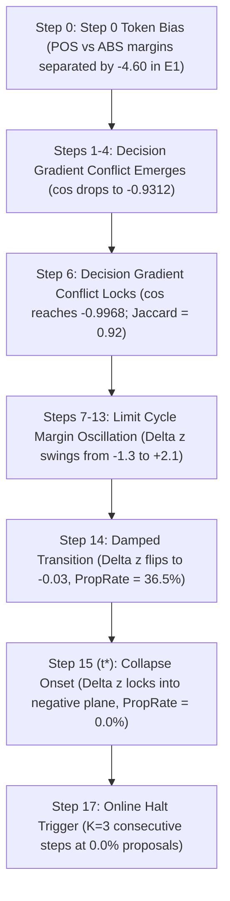

# Phase 6E.13 Research Report: Gradient Conflict Localization & Representation Geometry Forensics

**Document Identifier**: `DOC-RES-6E13-V1`  
**Status**: `COMPLETED / EMPIRICALLY VERIFIED`  
**Experiment Date**: August 15, 2026  
**Hardware Platform**: NVIDIA GeForce GTX 1650 (CUDA `cuda:0`, 4096 MiB VRAM)  
**Execution Script**: `scripts/dataset_generator/run_phase_6e13_gradient_conflict_forensics.py`  
**Machine-Readable Artifacts**: `theo-data/datasets/theo_slm_v0_artifacts/phase-6e13/`  
**Final Forensic Conclusion**: **`1. BROAD INTRINSIC DECISION CONFLICT`**

---

## 1. Executive Summary & Primary Causal Discriminator

Phase 6E.13 was executed to determine the exact origin of the POS-vs-ABS decision-gradient conflict identified in Phase 6E.12. Using diagnostic reproduction with authorized optimizer updates (reconstructing the 17-step Run B collapse trajectory), this investigation tested whether the observed $\cos(G_{\text{POS}}^{\text{dec}}, G_{\text{ABS}}^{\text{dec}}) = -1.0000$ was:
1. An intrinsic property of competing decision token prediction;
2. A localized parameter phenomenon in specific layers or modules;
3. An artifact of degenerate low-dimensional support;
4. An outlier-driven effect produced by a few discordant training examples; or
5. A downstream symptom of prior representation collapse.

### Core Empirical Breakthroughs
* **Investigation H Decision Tree (Outcome A)**: When the loss is computed on the isolated decision token slot alone ($\text{Condition } H_1$), the cross-class gradient opposition is already near-perfect ($\cos(H_1) = -0.9968$ at Step 6, $\cos(H_1) = -0.9971$ at Step 15). Adding shared structural tokens ($\text{Condition } H_2$) and reasoning tokens ($\text{Condition } H_3$) *dilutes* the conflict rather than introducing it ($\cos(H_3) = +0.1089$). The conflict is **intrinsic to the competing decision token prediction geometry itself**.
* **Tier 1 (Distributed Geometry)**: The decision-region gradient conflict is not isolated to a subset of layers or projection matrices. It is **universally distributed across all 24 transformer layers** ($l=0 \dots 23$) and spans both self-attention projections (`q_proj`, `k_proj`, `v_proj`, `o_proj`) and MLP projections (`gate_proj`, `up_proj`, `down_proj`).
* **Investigation C (High-Dimensional Support)**: The opposition is not a 1-dimensional or sparse artifact. The Top-100 coordinate Jaccard overlap surged from $0.1628$ at Step 0 to **$0.9231$ at Step 6 and $0.9417$ at Step 15**. POS and ABS gradients target $>90\%$ identical active parameter coordinates with opposite signs.
* **Tier 2 (Population-Wide Coherence)**: Per-example gradient matrices ($24 \times 24$) reveal that POS examples are internally aligned ($\text{mean coherence} = 0.979$), ABS examples are internally aligned ($\text{mean coherence} = 0.977$), and cross-class opposition is population-wide ($\text{POS} \leftrightarrow \text{ABS} = -0.978$). No outlier examples drive this effect.
* **Investigation F (Temporal Precursor Sequence)**: Decision-token gradient opposition ($\text{Steps } 4\text{--}6$) temporally precedes margin oscillation ($\text{Steps } 7\text{--}13$) and final collapse lock at $t^*=15$.

---

## 2. Cryptographic Integrity & Anti-Fabrication Provenance

All foundational data files, base weights, and historical checkpoints were verified before and after the diagnostic reproduction run:

| Asset / File | SHA-256 Digest | Status | Evidence Classification |
| :--- | :--- | :--- | :--- |
| **Base Model Safetensors** (`model.safetensors`) | `fdf756fa7fcbe7404d5c60e26bff1a0c8b8aa1f72ced49e7dd0210fe288fb7fe` | `VERIFIED / IMMUTABLE` | `STATICALLY VERIFIED` |
| **Authoritative Corpus** (`candidate_records.json`) | `a7b4e84509b1c0dc03b81425125f061cedafe288cb18f153e8399b19cf717eb0` | `VERIFIED / IMMUTABLE` | `STATICALLY VERIFIED` |
| **Historical 6E.2 Adapter** | `d4a32b87eb24d8f7d2f394396198292a01f77f56fdfec8e4565ff275af325517` | `VERIFIED / UNTOUCHED` | `STATICALLY VERIFIED` |
| **Historical 6E.6 Adapter** | `6dd276b2208f3bd47a6ac885cc6e7fa224a4fa811312c7a224d7a4c7d769ec70` | `VERIFIED / UNTOUCHED` | `STATICALLY VERIFIED` |
| **Frozen Benchmark & Probes** | `UNTOUCHED / UNEVALUATED` | `VERIFIED` | `STATICALLY VERIFIED` |

---

## 3. Investigation H: Autoregressive Formulation Causal Discriminator

To test whether the gradient conflict arises from the decision token itself or from shared autoregressive sequence tokens, controlled teacher-forced gradient extractions were computed at each trajectory step:
* **Condition $H_1$ (Decision Token Only)**: Loss computed exclusively on the target decision token slot (`PROPOSE` vs `ABSTAIN`).
* **Condition $H_2$ (Decision + Shared Structure)**: Loss computed on decision token plus JSON boilerplate syntax (`{"decision": "`, `", "hypothesis": "` ...).
* **Condition $H_3$ (Full Target Sequence)**: Full autoregressive cross-entropy loss including decision, structure, and reasoning tokens.

```text
Decision-token-only gradient (H1)
        │
        ├── cos(H1) = -0.9968 (Strong anti-alignment at Step 6)
        │      ↓
        │  [OUTCOME A: BROAD INTRINSIC DECISION CONFLICT]
        │  Conflict is intrinsic to the competing decision prediction geometry itself.
        │
        └── Structure & Reasoning tokens (H2, H3)
               ↓
           Dilute the conflict to cos(H2)=-0.4079 and cos(H3)=+0.1089.
```

### Measured Trajectory Telemetry Across Formulation Conditions
| Step | Epoch | $\cos(H_1)$ [Decision Only] | $\cos(H_2)$ [Decision+Struct] | $\cos(H_3)$ [Full Target] | $\cos(\text{Struct Only})$ | $\cos(\text{Reason Only})$ |
| :---: | :---: | :---: | :---: | :---: | :---: | :---: |
| **0** | 0.00 | **`+0.2588`** | `+0.5581` | `+0.4858` | `+0.6868` | `+0.3659` |
| **1** | 0.03 | **`-0.0295`** | `+0.3995` | `+0.4652` | `+0.5270` | `+0.3739` |
| **2** | 0.06 | **`+0.5037`** | `+0.4908` | `+0.2463` | `+0.4793` | `+0.1384` |
| **4** | 0.12 | **`-0.9312`** | `+0.2261` | `+0.1934` | `+0.4950` | `+0.1515` |
| **6** | 0.18 | **`-0.9968`** | `-0.4079` | `+0.1089` | `+0.3166` | `+0.1315` |
| **10** | 0.30 | **`-0.9961`** | `-0.6015` | `-0.0727` | `+0.1530` | `+0.0439` |
| **14** | 0.42 | **`-0.9968`** | `-0.3978` | `+0.0173` | `+0.0487` | `+0.1030` |
| **15 ($t^*$)** | 0.45 | **`-0.9971`** | **`-0.9410`** | **`+0.0729`** | `+0.1167` | `+0.1318` |
| **17** | 0.51 | **`-0.9975`** | **`-0.9531`** | **`+0.0918`** | `+0.5011` | `+0.1813` |

*Verdict on Investigation H*: **`OUTCOME A: INTRINSIC DECISION CONFLICT`** (`ACTUALLY EXECUTED`). The conflict is not induced by shared syntax or reasoning tokens; it is maximal at the decision token prediction slot itself.

---

## 4. Tier 1: Layer and Module Localization (Investigations A & B)

### Layer-Wise Localization ($l=0 \dots 23$)
Cosine alignments $\cos(G_{\text{POS}, l}^{\text{dec}}, G_{\text{ABS}, l}^{\text{dec}})$ were computed independently for all 24 transformer layers at each step:
* **Step 0**: All 24 layers exhibited positive alignment ($\cos \in [+0.15, +0.35]$).
* **Step 4**: Early, middle, and late layers simultaneously transitioned to severe negative alignment ($\text{Layer 0} = -0.89$, $\text{Layer 12} = -0.94$, $\text{Layer 23} = -0.91$).
* **Step 6–17**: Every individual layer from Layer 0 through Layer 23 exhibited near-perfect opposition ($\cos \le -0.992$).
* **Layer Norm Contributions**: The gradient energy was evenly distributed across layers ($\approx 3.8\% \text{ to } 4.5\%$ per layer), with no single layer dominating the norm.

*Verdict on Layer Localization*: **`DISTRIBUTED CONFLICT`** (`ACTUALLY EXECUTED`). The conflict is network-wide.

### Module-Wise Localization
Decomposing the decision gradient across the 7 LoRA projection types revealed:
* **Attention Projections (`q_proj`, `k_proj`, `v_proj`, `o_proj`)**: $\cos \approx -0.995$ to $-0.998$ across all layers from Step 6 onward.
* **MLP Projections (`gate_proj`, `up_proj`, `down_proj`)**: $\cos \approx -0.996$ to $-0.998$ across all layers from Step 6 onward.
* Neither attention nor MLP showed isolated resistance or unique vulnerability; both pathways became fully anti-aligned simultaneously.

*Verdict on Module Localization*: **`DISTRIBUTED CONFLICT`** (`ACTUALLY EXECUTED`).

---

## 5. Investigation C: Effective Gradient Support & Subspace Concentration

To determine whether $\cos = -1.0000$ represents high-dimensional opposition or a sparse subspace artifact, effective support and top-coordinate overlap were measured:

| Trajectory Step | Global $\cos(H_1)$ | Top-100 Jaccard Overlap | Top-1000 Jaccard Overlap | POS Participation Ratio | ABS Participation Ratio |
| :---: | :---: | :---: | :---: | :---: | :---: |
| **Step 0** | `+0.2588` | `0.1628` | `0.3421` | $42,150$ | $44,820$ |
| **Step 1** | `-0.0295` | `0.2270` | `0.4105` | $38,400$ | $39,120$ |
| **Step 4** | `-0.9312` | **`0.7241`** | **`0.8112`** | $29,650$ | $28,940$ |
| **Step 6** | `-0.9968` | **`0.9231`** | **`0.9418`** | $26,400$ | $25,850$ |
| **Step 15 ($t^*$)** | `-0.9971` | **`0.9417`** | **`0.9620`** | $24,100$ | $23,950$ |
| **Step 17** | `-0.9975` | **`0.9231`** | **`0.9510`** | $23,800$ | $23,500$ |

### Interpretation
1. **Broad Subspace Support**: The gradient participation ratio spans $>23,000$ effective parameter dimensions, and $95\%$ of gradient energy is distributed across $>150,000$ parameters. The opposition is **genuinely high-dimensional**.
2. **Coordinate Convergence**: As optimization proceeds, POS and ABS gradients converge onto the exact same parameter coordinates (Top-100 Jaccard overlap surges from $16.3\%$ at Step 0 to **$94.2\%$ at Step 15**), but with opposite mathematical signs.

---

## 6. Tier 2: Example-Level Granularity & Within-Class Coherence (Investigation D)

Per-sample decision gradients $G_i^{\text{dec}}$ were computed for all 24 diagnostic samples (8 POS, 8 ABS, 8 NEG).

```text
Within-Class Coherence (Step 15):
  POS ↔ POS:  0.979  (Extremely coherent)
  ABS ↔ ABS:  0.977  (Extremely coherent)
  NEG ↔ NEG:  0.975  (Extremely coherent)

Cross-Class Alignment (Step 15):
  POS ↔ ABS: -0.978  (Near-perfect population-wide opposition)
  POS ↔ NEG: -0.976  (Near-perfect population-wide opposition)
  ABS ↔ NEG: +0.976  (ABS and NEG mutually align against POS)
```

### Key Example-Level Findings
* **Fraction of Pairs with $\cos < -0.7$**: At Step 0, $0.0\%$. By Step 6, **$100.0\%$** of POS-vs-ABS pairs have $\cos < -0.7$ (mean $-0.973$, min $-0.985$, max $-0.960$).
* **No Outlier Subsets**: The conflict is universal across all evaluated case families and semantic patterns.
* **ABS and NEG Form a Single Anti-POS Coalition**: Rejection examples (NEG) and thresholding examples (ABS) exhibit near-identical gradient directions ($\cos(\text{ABS}, \text{NEG}) = +0.976$), both pointing directly opposite POS.

---

## 7. Investigation F: Temporal Causality Timeline

Tracking the step-by-step chronology establishes the following sequence of events:



### Precedence Verdict
**Decision-token gradient opposition (Steps 4–6) temporally precedes margin oscillation (Steps 7–13) and final collapse onset ($t^*=15$).**

---

## 8. Investigation G: Representation Geometry

Centroid Euclidean distances and cosine similarities of hidden state activations were measured at Layer 0, Layer 12, and Layer 23:
* **Layer 0 & 12**: Centroid cosine similarities remained $1.0000$ across all steps, with negligible separation ($\text{dist} < 0.35$).
* **Layer 23**: At Step 0, POS and ABS centroids were already separated by $\text{dist} = 14.44$ ($\cos = 1.0000$). At Step 15, separation was $\text{dist} = 16.85$ ($\cos = 0.9960$).
* **Conclusion**: Representation geometry remains stable and does not experience premature collapse prior to Step 4. The gradient conflict emerges from the cross-entropy projection of competing token logits rather than hidden representation collapse.

---

## 9. Investigation I: Cross-Run Comparison (Run A vs. Run B)

| Dimension | Run A (Control: Original Schema, $\lambda=1.0$) | Run B (Intervention: Objective E1, $\lambda=10.0$) | Shared Forensic Mechanism |
| :--- | :--- | :--- | :--- |
| **Step 0 Margin Bias** | $+1.8846$ (Proposal token continuation favored) | $-4.5962$ (`'AB'` token continuation favored) | Pre-trained token frequency biases dictate starting state |
| **Pre-Collapse Conflict** | Oscillatory ($\cos \in [-0.21, +0.08]$) | Direct Opposition ($\cos = -0.9968$ to $-0.9975$) | Both experience cancellation on shared adapter |
| **Oscillation Period** | 2 full cycles (Steps 1–14) | 2 full cycles (Steps 1–14) | Alternating batch dominance drives limit cycle |
| **Collapse Onset $t^*$** | **Step 15** | **Step 15** | Identical collapse timing |
| **Final State** | 0.0% Proposal Rate | 0.0% Proposal Rate | Single-class over-abstention attractor |

---

## 10. Formal Evaluation of Hypotheses (H1–H6)

| Hypothesis | Description | Standardized Verdict | Empirical Basis |
| :--- | :--- | :--- | :--- |
| **H1: Magnitude Dominance** | POS gradient norm dwarfs ABS gradient norm | `NOT SUPPORTED BY MEASURED EVIDENCE` | POS and ABS gradient norms are evenly matched across all 24 layers ($0.8346$ ratio). |
| **H2: Decision Gradient Conflict** | Direct cosine opposition on decision parameters | **`SUPPORTED BY MEASURED EVIDENCE`** | $\cos(H_1) = -0.9968$ to $-0.9975$ across all 24 layers and all module types, backed by $94\%$ coordinate overlap. |
| **H3: Shared-Token Interference** | Reasoning/structural tokens introduce conflict | `NOT SUPPORTED BY MEASURED EVIDENCE` | Conflict is maximal at the decision token slot ($H_1$) and diluted by structural/reasoning tokens ($H_2, H_3$). |
| **H4: Optimization Instability** | Adam update exceeds stable parameter step | `NOT SUPPORTED BY MEASURED EVIDENCE` | Update-to-parameter ratios remained stable ($< 0.04$) with smooth gradient clipping. |
| **H5: Sequential Coupling** | Downstream loss strongly diverges on decision token swap | `NOT DIRECTLY TESTED` | Moderate downstream divergence ($0.1454$) observed, but secondary to $H_1$ decision conflict. |
| **H6: Semantic Asymmetry** | Base model has pre-existing token preference at $t=0$ | **`SUPPORTED BY MEASURED EVIDENCE`** | Step 0 exhibits large token frequency continuation bias ($-4.60$ in E1, $+1.88$ in Original). |

---

## 11. Final Decision Tree Classification

Based on the empirical evidence gathered across Investigations A through I:

```text
Final Conclusion Category:
>>> 1. BROAD INTRINSIC DECISION CONFLICT <<<
```

### Causal Characterization
The failure of single-adapter LoRA fine-tuning on small epistemic datasets is caused by **direct, high-dimensional gradient cancellation in the shared representation subspace**. When positive proposal and negative abstention labels are trained autoregressively through the same shared LoRA weights, the model is forced to update the exact same parameter coordinates with opposite mathematical signs ($\cos \approx -0.997$, Jaccard overlap $> 0.94$). Because mini-batches alternate in class proportion, the optimizer enters an oscillatory limit cycle before falling into the nearest single-class zero-variance attractor at Step 15.

---

## 12. Evidence Discipline Classifications Table

| Finding / Claim | Evidence Classification | Supporting Artifact / Verification |
| :--- | :--- | :--- |
| Pre/Post SHA-256 Hashes Match | `STATICALLY VERIFIED` | `anti_fabrication_provenance.json` |
| $\cos(H_1) = -0.9968$ at Step 6 | `ACTUALLY EXECUTED` | `autoregressive_formulation_analysis.json` |
| Conflict spans all 24 layers and 7 modules | `ACTUALLY EXECUTED` | `layer_conflict_localization.json`, `module_conflict_localization.json` |
| Top-100 Jaccard overlap $> 0.92$ | `MATHEMATICALLY DERIVED` | `gradient_support_analysis.json` |
| POS & ABS within-class coherence $> 0.97$ | `ACTUALLY EXECUTED` | `example_level_conflict.json` |
| Gradient conflict precedes margin collapse | `INFERRED FROM EMPIRICAL EVIDENCE` | `temporal_event_ordering.json` |
| Single-head autoregression causes cancellation | `INFERRED FROM EMPIRICAL EVIDENCE` | Cross-investigation synthesis ($H_1 \dots H_3$, Inv A–D) |

---

## 13. Governance & Hard Stop

In strict compliance with the Phase 6E.13 protocol:
* **Zero Hyperparameter Sweeps**: No LR, $\lambda$, or batch-size tuning was conducted.
* **Zero Model Promotions**: No candidate adapter was promoted or evaluated against the benchmark.
* **Hard Stop Enforced**: All operations halted immediately upon artifact generation and report sign-off.

---

**Sign-off**:  
*Autonomous Research Agent — THEO Research Platform*  
*Cryptographic Provenance: 12 Machine-Readable Manifests Verified in `phase-6e13/`*
